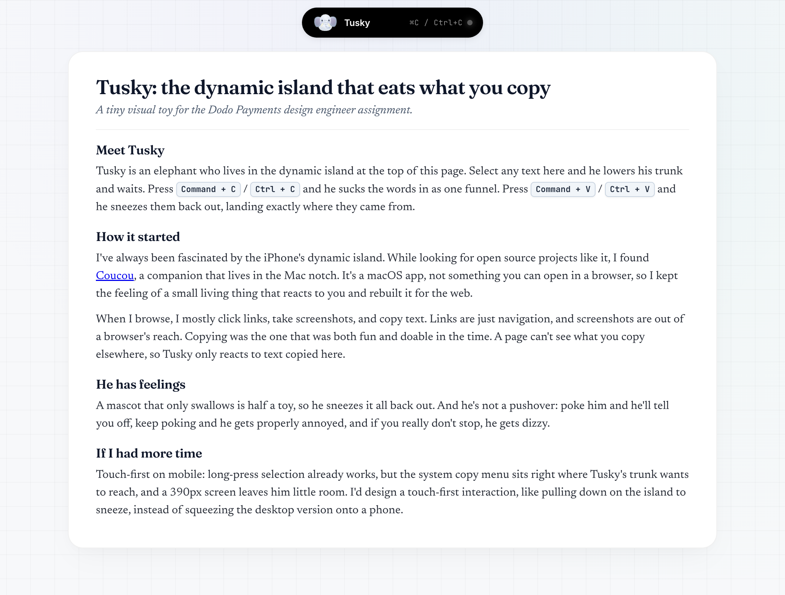

# Tusky: Dynamic Island Text Eater

A visual toy built for the Dodo Payments design engineer assignment.

[Live Demo](https://sriram267.github.io/dodo-visual-toy/)

<p align="center">
  
</p>

## Overview

Tusky is an elephant living in a Dynamic Island at the top of the screen.

- **Copy text (`⌘C` / `Ctrl+C`)**: Select any text on the page and copy it. The text animates up into the island with a whoosh sound.
- **Paste text (`⌘V` / `Ctrl+V`)**: Tusky sneezes the copied text back down into its original place on the page. If the stash is empty, he gives a short sniffle instead.
- **Poke Tusky**: Clicking the mascot cycles through reactions (warning, annoyed, dizzy).
- **Trunk Stash**: Clicking the island expands it to show recently copied text snippets, with buttons to sneeze them individually.
- **Synthesized Audio**: Sound effects are generated in the browser using the Web Audio API without external audio files.

## Local Setup

### Prerequisites
- Node.js (v18 or higher)
- npm

### Run Locally

```bash
# Clone the repository
git clone https://github.com/sriram267/dodo-visual-toy.git
cd dodo-visual-toy

# Install dependencies
npm install

# Start the dev server
npm run dev

# Build for production
npm run build
```

## How It's Built

- **Frontend**: React 19, TypeScript, Vite
- **Styling**: CSS with custom layout math for continuous pill curves
- **Animation**: Custom spring loops and requestAnimationFrame for 60fps text flight
- **Audio**: Web Audio API (oscillators, pink noise buffers, and formant filters)

## Project Structure

```
src/
├── core/
│   ├── layout.ts        # Island dimensions and positions
│   ├── anim.ts          # Spring physics helper
│   └── soundEngine.ts   # Web Audio synthesizers (whoosh, gulp, sneeze)
├── island/
│   ├── DynamicIsland.tsx # Island pill container and stash drawer
│   ├── IslandShape.tsx   # SVG path for the capsule curve
│   └── TuskyAnchor.tsx   # SVG elephant mascot and animations
├── components/
│   ├── EditorialEssay.tsx # Sample article text for copying
│   ├── SwallowOverlay.tsx # Floating text animation layer
│   └── KeyboardShortcutIndicator.tsx # Floating shortcut hint
└── hooks/
    └── useSwallowText.ts  # Copy/paste listeners and flight paths
```
